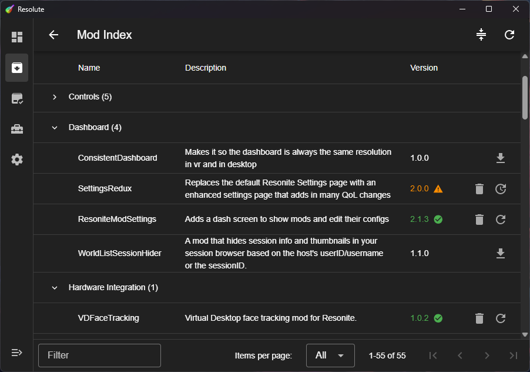

<h1 align="center">
	<a href="https://github.com/Gawdl3y/Resolute">
		 
		Resolute
	</a>
</h1>

	<strong>Mod Manager GUI for Resonite</strong>

 

Resolute is a friendly GUI application for installing, updating, and managing Resonite mods.
The goal is to provide a cross-platform beginning-to-end setup experience for Resonite modding.

Resolute loads its mod index and metadata from the
[Resonite Mod Manifest](https://github.com/resonite-modding-group/resonite-mod-manifest).

> [!IMPORTANT]  
> Resolute is built with [Tauri](https://tauri.app/), which relies upon your operating system's WebView to function.
> If you're on Windows and have completely removed WebView2 and Edge from your system, Resolute will not work.
> If you remove Edge but leave WebView2 intact, it should work fine.

	

## Features

### Implemented

- Manifest handling
  - Downloading
  - Caching
  - Parsing
- Mod management
  - Listing (installed and all available)
  - Installation
  - Updating
  - Deletion
  - Detection of externally-installed mods
- Mod authoring tools
  - SHA-256 checksum calculator
- Automatic app updates

### Planned

- Mod disabling/reenabling
- Drop mod file to install
- ResoniteModLoader/Harmony alerts (missing or outdated)
- Deprecated mod/mismatched platform alerts
- Dependency resolution
  - Automatic installation
  - Conflict warnings
- CLI

## Downloads

All release builds are available in the [Releases](https://github.com/Gawdl3y/Resolute/releases) section, but below are
some quick links for the most common ones from the latest release ([v0.8.3](https://github.com/Gawdl3y/Resolute/releases/tag/v0.8.3)).

- [Windows installer (exe)](https://github.com/Gawdl3y/Resolute/releases/download/v0.8.3/Resolute_0.8.3_x64-setup.exe)
- [Linux AppImage (Universal)](https://github.com/Gawdl3y/Resolute/releases/download/v0.8.3/resolute_0.8.3_amd64.AppImage)
- [Linux RPM (Fedora, RHEL, etc.)](https://github.com/Gawdl3y/Resolute/releases/download/v0.8.3/resolute-0.8.3-1.x86_64.rpm)
- [Linux DEB (Debian, Ubuntu, etc.)](https://github.com/Gawdl3y/Resolute/releases/download/v0.8.3/resolute_0.8.3_amd64.deb)

## Contributing

All contributions are welcome!
Try to keep PRs relatively small in scope (single feature/fix/refactor at a time) and word your commits descriptively.

The project is built with [Tauri](https://tauri.app/), which is similar to Electron but faster and much more lightweight.
It uses Rust for the backend application code and HTML/JS/CSS via the user's operating system's WebView for the frontend.
Specifically, Resolute's frontend is a [Vue](https://vuejs.org/) single-page application using [Vuetify](https://vuetifyjs.com/) as its UI framework.

The library code in [crates/resolute](./crates/resolute) is externally reusable by other projects and thus is versioned separately.
Most new features on the backend are developed there first, with the application code in [crates/tauri-app](./crates/tauri-app) simply calling those library functions.

Resolute uses [ESLint](https://eslint.org/) + [Prettier](https://prettier.io/) for HTML/JS (frontend) linting/style enforcement
and [Clippy](https://github.com/rust-lang/rust-clippy) + [rustfmt](https://github.com/rust-lang/rustfmt) for Rust (backend) linting/style enforcement.

### Directory breakdown

- [crates/resolute](./crates/resolute): Main Resolute library code where most business logic lives
- [crates/tauri-app](./crates/tauri-app): Tauri application code (the backend of the app)
- [ui](./ui): Frontend UI code

## License

Most of the project is licensed under the [GPLv3 license](https://www.gnu.org/licenses/gpl-3.0).  
The library code located in [crates/resolute](./crates/resolute) is instead licensed under the [LGPLv3 license](https://www.gnu.org/licenses/lgpl-3.0).
